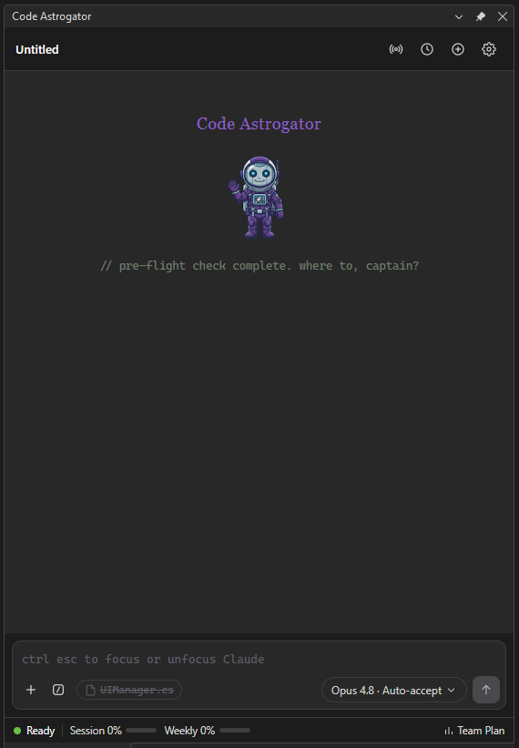
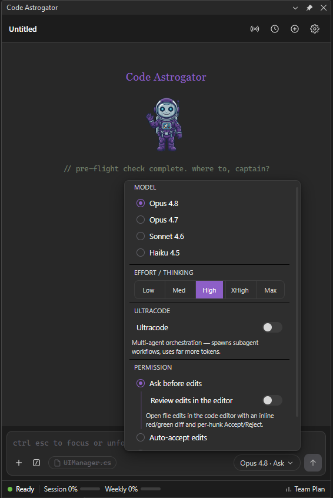
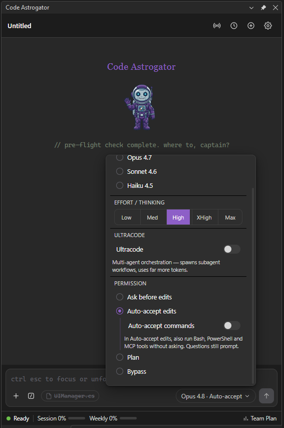
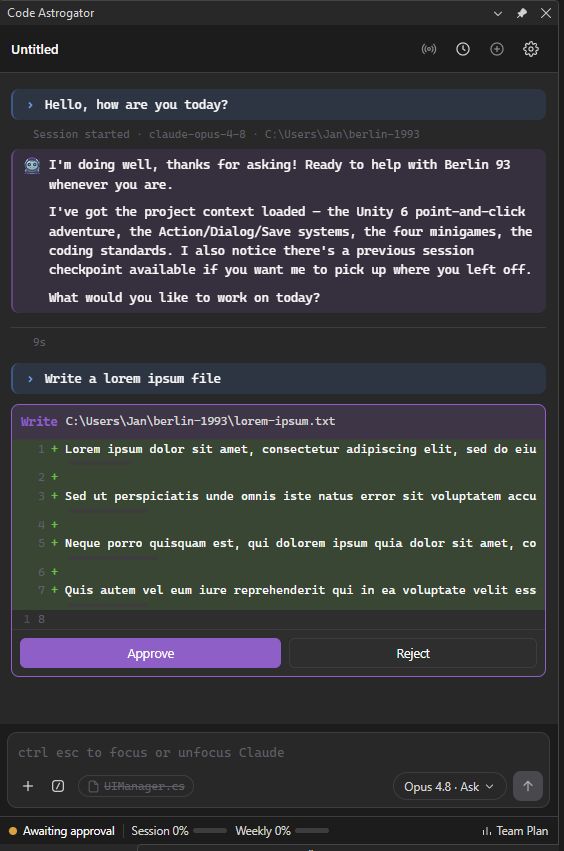
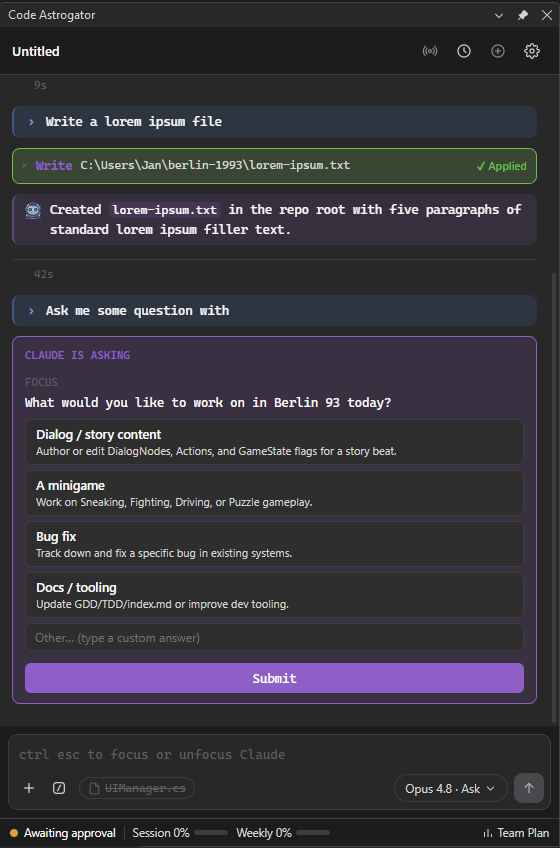
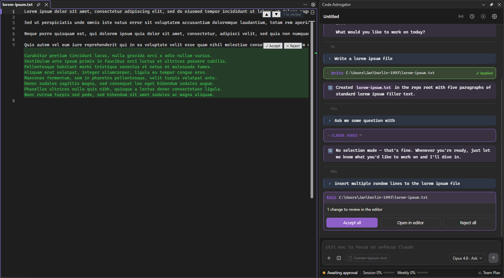
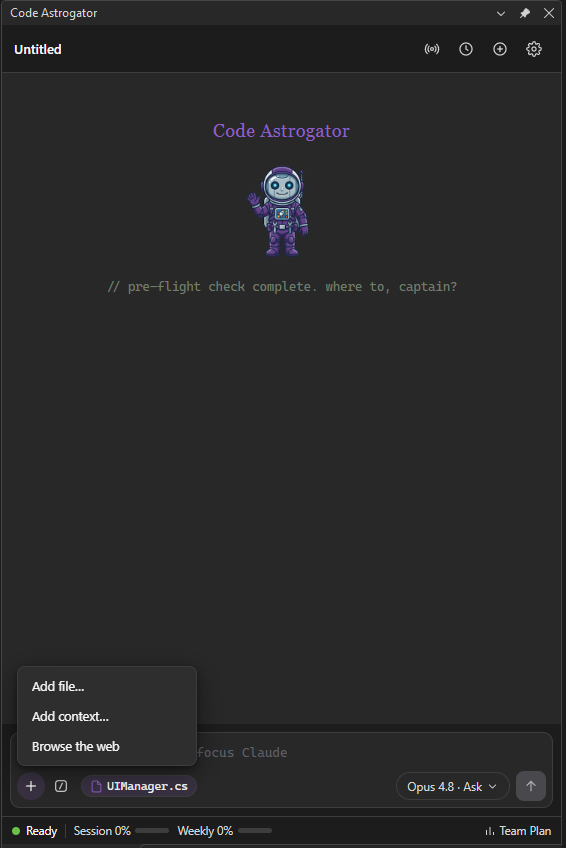
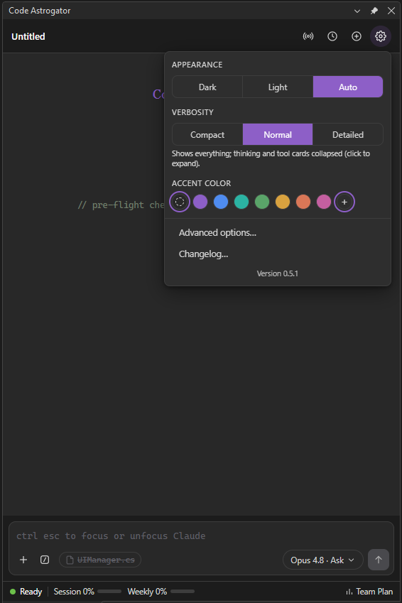

# Code Astrogator

**Claude Code chat tool window for Visual Studio 2026**

Integrates the [Claude Code CLI](https://docs.claude.com/en/docs/claude-code) into a dockable
chat panel — streaming responses, live tool activity, and interactive approve/reject for
Claude's edits and commands, right inside the IDE.

Created by Jan Hüls "finex7070" StickyStoneStudio GmbH 🚀

 

---

## What it is

Code Astrogator brings Claude Code into Visual Studio as a dockable chat panel. It drives the
**Claude Code CLI** behind the scenes, so it works with whatever you already use to sign in:
**both a Claude subscription (OAuth) and an API key** are supported — the extension never handles
your credentials itself.

## Features

- **Streaming chat** with Markdown (incl. tables), code blocks with copy / insert-into-editor, and
  extended-thinking display. A live "working" indicator keeps you company while Claude thinks.
- **Tool activity cards** for Read / Grep / Bash / Edit / Write / MCP tools, with collapsible
  input/output and success/error tinting.
- **Permission cards** — review and approve or reject Claude's file edits and commands inline in the
  chat, with a syntax-highlighted diff; auto-approved edits show as a green pre-decided card.
- **Inline edit review in the editor (opt-in)** — instead of a chat diff, review proposed edits
  *directly in the code editor*: to-be-deleted lines in red, to-be-added lines as green phantom lines
  (the file is never touched during review), with **Accept / Reject per hunk**, scrollbar change
  marks, and a jump-to-next/previous-change toolbar. Accept only the hunks you want.
- **Auto-approve patterns** — allow chosen commands/MCP tools to run without prompting, plus an
  "Always" button on permission cards. An **"Auto-accept commands"** sub-toggle additionally runs
  Bash / PowerShell / MCP calls without prompting while in Auto-accept-edits mode.
- **Interactive questions** — Claude's follow-up questions appear as in-turn cards with clickable
  options and a free-text "Other".
- **Tasks banner** — when Claude works through a multi-step task list, a collapsible banner shows each
  task with its live status and a done/total count.
- **Model · Mode popover** — pick model, effort (incl. Max), ultracode, and permission mode (Ask /
  Auto-accept edits / Plan / Bypass); your choices persist across chats and restarts.
- **Usage meters** — session and weekly usage with reset-time tooltips and a plan badge (read locally,
  no extra cost).
- **Session history** per workspace; conversations resume across VS restarts.
- **Context attachments** — `@`-mention autocomplete, file drag-and-drop from Explorer, clipboard
  image/file paste, web browsing, an active-file reference (with selected line ranges), and editor
  right-click → "Add file / selection to Claude prompt".
- **Remote control** — open the *current* conversation in an interactive Claude Code session with
  remote control enabled, continue it from the Claude app or claude.ai/code, then re-import the
  advanced conversation when you end the session.
- **Announcements & update notifications** (opt-in) — an in-window banner for project notices and a
  pointer to new releases.
- **Theming** — Dark / Light / Auto (follows the VS theme), a configurable accent color, and three
  verbosity levels (Compact / Normal / Detailed).

## Screenshots

### Pick model, effort, and how edits are approved

The **Model · Mode** popover selects the model, effort/thinking level, ultracode, and the permission
mode. Under **Ask before edits** you can opt into reviewing edits inline in the editor; under
**Auto-accept edits** an **Auto-accept commands** sub-toggle lets Bash / PowerShell / MCP calls run
without prompting too.

  
  

### Approve edits and commands

When Claude wants to edit a file or run a command, an approval card appears in the chat with a diff —
**Approve** or **Reject**. Claude's follow-up questions show up as interactive cards with clickable
options.

  
  

### Inline edit review in the editor (opt-in)

With "Review edits in the editor" turned on, proposed changes are shown right in the code editor —
green phantom lines for additions, red for deletions — with **Accept / Reject per hunk**, scrollbar
marks, and a jump-to-change toolbar. The chat card offers **Accept all**, **Open in editor**, or
**Reject all**.

  

### Attach context and tune appearance

Attach files, paste images, reference the active editor file, or browse the web from the `+` menu.
The gear popover sets theme, verbosity, and accent color, and links to advanced options and the
changelog.

  
  

## Requirements

- **Visual Studio 2026** (Community, Professional, or Enterprise).
- The **[Claude Code CLI](https://docs.claude.com/en/docs/claude-code)** installed and on your `PATH`
  (or point to it in settings) and signed in:
  - **Subscription:** run `claude /login`.
  - **API key:** sign in with your Anthropic API key.

## Installation

1. Download the latest **`CodeAstrogator.vsix`** from the
   [**Releases**](https://github.com/finex7070/CodeAstrogator/releases) page.
2. **Close Visual Studio**, then double-click the `.vsix` to install (it over-installs any previous
   version).
3. Reopen Visual Studio and show the panel via **View → Other Windows → Code Astrogator**.

## Getting started

1. Make sure the Claude Code CLI is signed in (see [Requirements](#requirements)). If not, the panel
   shows a sign-in hint.
2. Type a prompt and press **Enter** (Shift+Enter for a new line).
3. When Claude wants to edit a file or run a command, an approval card appears — review it and
   **Approve** or **Reject**.
4. Use the toolbar to attach files (`+`), run slash commands (`/`), or change model and permission
   mode (**Model · Mode**).

The working directory of each turn is your open solution/folder, so Claude has your project context.

## Settings

Open settings via the **gear icon → "Advanced options…"**. From there you can configure, among others:

- The Claude CLI path (if it isn't on `PATH`), default model / effort, theme, and verbosity.
- Permission mode and the auto-approve pattern list.
- Restore-last-session, auto-add active file, include selected lines.
- Prompt timeout, and whether to use a persistent CLI session.
- Whether to receive announcements and update notifications.

Quick appearance options (theme, accent color) are also available directly in the gear popover.

## Release notes

See [`CHANGELOG.md`](CHANGELOG.md) for the version history.

## License

GNU Affero General Public License v3.0 (AGPLv3)

This project is open-source and available under the AGPLv3 license.

✅ Commercial Use: You are free to use this extension for commercial work (e.g., in a paid development environment or for client projects).
✅ Modification: You are free to modify the code to suit your needs.
🔄 Copyleft: If you distribute a modified version — or make one available to others — you must release your modifications under the same AGPLv3 license. Closed-source proprietary forks are not allowed.

See the [LICENSE](LICENSE) file for full details.

> "Claude" and "Claude Code" are products of Anthropic; this extension integrates the Claude Code CLI but is not affiliated with or endorsed by Anthropic.

---

> Made with ❤️ by Jan Hüls "finex7070" [StickyStoneStudio GmbH](https://www.stickystonestudio.com)
